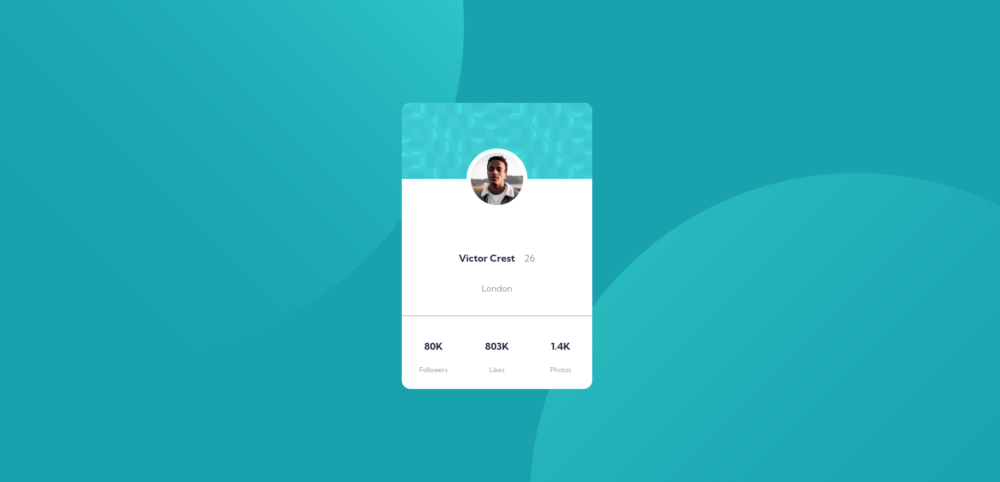

# Frontend Mentor - Profile card component solution

This is a solution to the [Profile card component challenge on Frontend Mentor](https://www.frontendmentor.io/challenges/profile-card-component-cfArpWshJ). Frontend Mentor challenges help you improve your coding skills by building realistic projects. 

## Table of contents

- [Overview](#overview)
  - [The challenge](#the-challenge)
  - [Screenshot](#screenshot)
  - [Links](#links)
- [My process](#my-process)
  - [Built with](#built-with)
  - [What I learned](#what-i-learned)
  - [Continued development](#continued-development)
  - [Useful resources](#useful-resources)
- [Author](#author)
- [Acknowledgments](#acknowledgments)


## Overview

### The challenge

- Build out the project to the designs provided

### Screenshot



### Links

- Solution URL: (https://github.com/francobwogo/ProfileCard.git)
- Live Site URL: (https://francobwogo.github.io/ProfileCard/)

## My process

### Built with

- Semantic HTML5 markup
- CSS custom properties
- Flexbox
- CSS Grid
- Mobile-first workflow

### What I learned

How to use CSS position, background-image, background-position and background-size.

```css
.container {
  display: flex;
  align-items: center;
  justify-content: center;
  padding: 1.5em 1em;
  margin: auto;
  height: 80vh;
  background-color: var(--clr-primary-dark-cyan);
  background-image: url(/images/bg-pattern-top.svg),
    url(/images/bg-pattern-bottom.svg);
  background-repeat: no-repeat;
  background-position: top -18.75em left -18.75em,
    bottom -18.75em right -18.75em;
  background-size: 37.5em;
}

.card-img {
  border-radius: 50%;
  border: 0.5em solid white;
  position: relative;
  top: -3.5em;
}
```
```css
.proud-of-this-css {
  color: papayawhip;
}
```

### Continued development

I need to learn more on CSS.

### Useful resources

### Useful resources

- The NetNinja - CSS Tutorial For Beginners 46 - Multiple Backgrounds(https://www.youtube.com/watch?v=Sj7Hs94uZjE) - How to work with multiple backgrounds.
- Kevin Powell - Responsive design made easy (https://www.youtube.com/watch?v=bn-DQCifeQQ&t=2119s) - This helped me learn responsive web design. Kevin's workflow is easy to learn and use.
- The Odin Project (https://www.theodinproject.com/).

## Author

- Frontend Mentor - [@francobwogo](https://www.frontendmentor.io/profile/francobwogo)
